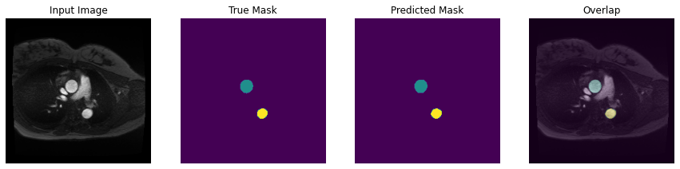

# Deep Learning for MRI image segmentation with U-Net architecture.

Reference: tensorflow.org

## What is image segmentation?

Other than image classification, where the task of the network is to assign a label or class to an input image, you want to know where an object is located in the image, the shape of that object, which pixel belongs to which object, etc. In this case you will want to segment the image, i.e., each pixel of the image is given a label. Thus, the task of image segmentation is to train a neural network to output a pixel-wise mask of the image. This helps in understanding the image at a much lower level, i.e., the pixel level. Image segmentation has many applications in medical imaging, self-driving cars and satellite imaging to name a few.

## Dataset

The dataset that will be used for this tutorial is the aortic MRI Images from a hospital in Paris, created at Laboratoire d'Imagerie Biomédical (LIB) of Sorbonne University. The dataset consists of images, their corresponding labels, and pixel-wise masks. The masks are basically labels for each pixel. Each pixel is given one of three categories :

Class 1 : Pixel belonging to the ascending aorta.

Class 2 : Pixel belonging to the descending aorta.

Class 3 : None of the above/ Surrounding pixel.

